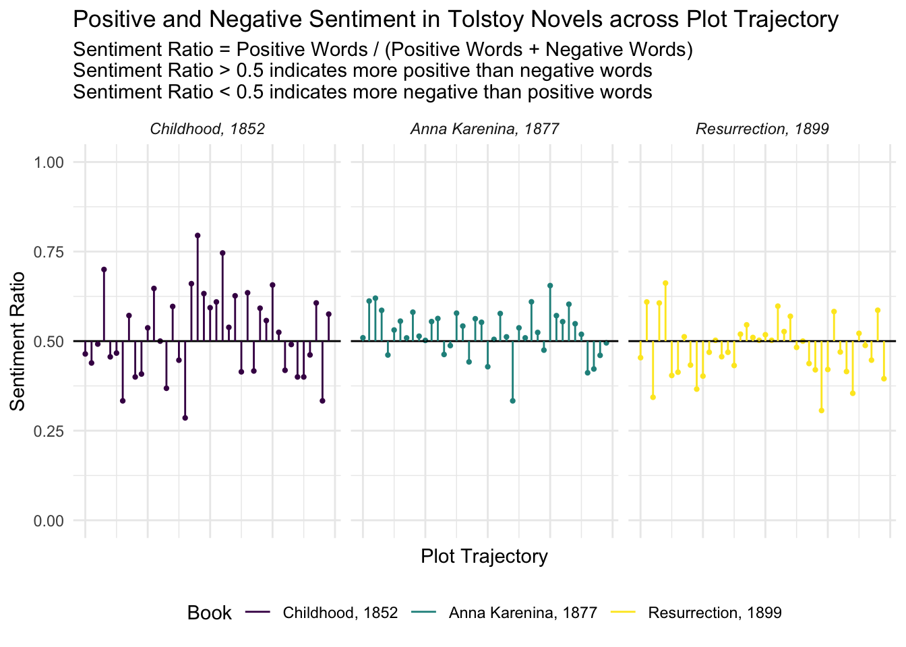
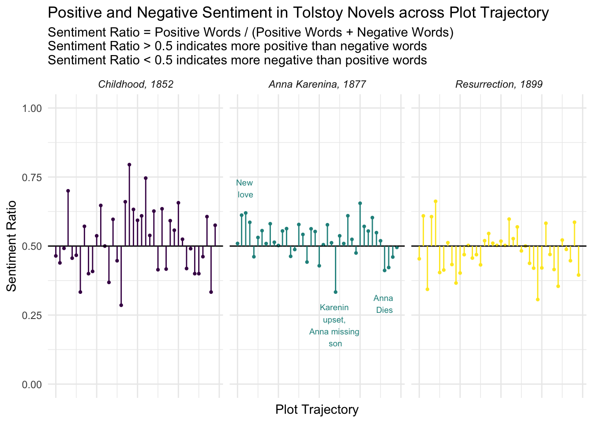

#Introduction
Goal: Create a graph showing sentiment analysis of three Tolstoy novels over his career.
  - I.e., evaluate the relative *positivity* and *negativity* of words in Tolstoy's novels
  
Inspired by Julia Silge's [sentiment analysis of Jane Austen novels](https://juliasilge.com/blog/life-changing-magic/).

Hypothesis: Tolstoy's last novel, *Resurrection*, will have a different sentiment pattern than his others.

---
#Description of the Data
Full text of three novels by Leo Tolstoy:
  - *Childhood* (1852), translated into English by C.J. Hogarth
  - *Anna Karenina* (1877), translated into English by Constance Garnett
  - *Resurrection* (1899), translated into English by Mrs. Louise Maude

Plaintext copies pulled from [Project Gutenburg.](http://www.gutenberg.org/)

Data cleaned and processed using `Python`, then read into R:


```r
glimpse(data)
```

```
## Observations: 564,231
## Variables: 3
## $ rowname <chr> "1", "2", "3", "4", "5", "6", "7", "8", "9", "10", "11...
## $ title   <chr> "childhood", "childhood", "childhood", "childhood", "c...
## $ words   <chr> "the", "tutor", "karl", "ivanitch", "on", "the", "of",...
```

---
#Description of the Data
This data was then combined with the `tidytext::get_sentiments()` function, which has an assignment of sentiment values to words:


```r
glimpse(get_sentiments("bing"))
```

```
## Observations: 6,788
## Variables: 2
## $ word      <chr> "2-faced", "2-faces", "a+", "abnormal", "abolish", "...
## $ sentiment <chr> "negative", "negative", "positive", "negative", "neg...
```

---
#Methods
Combined the text data with the sentiment data as follows:

- Join sentiment values (either "positive" or "negative") to words in `data`
- Divide each novel's data into 40 sections, then count number of positive and negative words in each section 
- Calculate the ratio of positive words to positive and negative words

```r
head(data_final)
```

```
## # A tibble: 6 x 5
## # Groups:   title [1]
##   title         index negative positive sentiment
##   <fct>         <dbl>    <dbl>    <dbl>     <dbl>
## 1 anna_karenina     0      289      300     0.509
## 2 anna_karenina     1      222      350     0.612
## 3 anna_karenina     2      230      375     0.620
## 4 anna_karenina     3      224      317     0.586
## 5 anna_karenina     4      299      256     0.461
## 6 anna_karenina     5      272      308     0.531
```


---
#Final Visualization Part 1: Lollipop Plot


---
#Methods
- Used `ggplot2` (of course)!
- Used `geom_point()`, `geom_hline()`, and `geom_segment()` to create the lollipops
- Used `facet_wrap()` by title, relabel with nice names
- Used `fct_relevel()` to order the books by year
- Added axis labels and title/subtitle, change colors, edited legend

---
#Final Visualization Part 1: Lollipop Plot


---
#How can we improve this?
###Ideas:
- Legend at the bottom is repetitive
- Add annotations-- what's happening in these various sections?


---
#How can we improve this?
###Implementation:
- Add in `theme(legend.position = "none")`
- Add a `text` variable as follows:

```r
data_final_2[24:26,]
```

```
## # A tibble: 3 x 6
## # Groups:   title [1]
##   title         index negative positive sentiment text                    
##   <fct>         <dbl>    <dbl>    <dbl>     <dbl> <chr>                   
## 1 anna_karenina    23      307      322     0.512 " "                     
## 2 anna_karenina    24      428      214     0.333 "Karenin \nupset, \nAnn…
## 3 anna_karenina    25      256      297     0.537 " "
```
- Then add a `geom_text()` layer to the plot

---
#Final Visualization Part 2: Lollipop Plot



---
#Methods


```r
plot_2 <- ggplot(data_final_2, aes(index, sentiment, color =  title, label = text)) +
  geom_point(size = .8, show.legend = FALSE) +
  geom_hline(aes(yintercept=.5))+
  geom_segment(aes(x=index, xend = index, y = sentiment, yend = .5)) +
  facet_wrap(~title, ncol = 3, labeller = labeller(title = labels)) +
  ggtitle("Positive and Negative Sentiment in Tolstoy Novels across Plot Trajectory", subtitle = "Sentiment Ratio = Positive Words / (Positive Words + Negative Words) \nSentiment Ratio > 0.5 indicates more positive than negative words \nSentiment Ratio < 0.5 indicates more negative than positive words      ") +
  labs(x = "Plot Trajectory", y = "Sentiment Ratio")+
  expand_limits(y=c(0,1)) +
  scale_color_viridis(discrete = TRUE, name = "Book", labels = labels) +
  theme_minimal() +
  theme(strip.text = element_text(face = "italic")) +
  theme(axis.ticks.x=element_blank()) +
  theme(axis.text.x=element_blank()) +
  theme(legend.position = "none") +
  geom_text(size = 3, aes(y = case_when(sentiment>.5 ~ sentiment + .09,
                                          sentiment <= .5 ~ sentiment -.12)))
```

---
#References
https://machinelearningmastery.com/clean-text-machine-learning-python/

https://www.tidytextmining.com/sentiment.html

https://juliasilge.com/blog/life-changing-magic/

https://python-graph-gallery.com/lollipop-plot/

---
class: center
#Thank you!
##Special thanks to Alison Hill, Steven Bedrick, and Jackie Wirz
##And to you all! :)
##Any questions/ideas for next steps?
