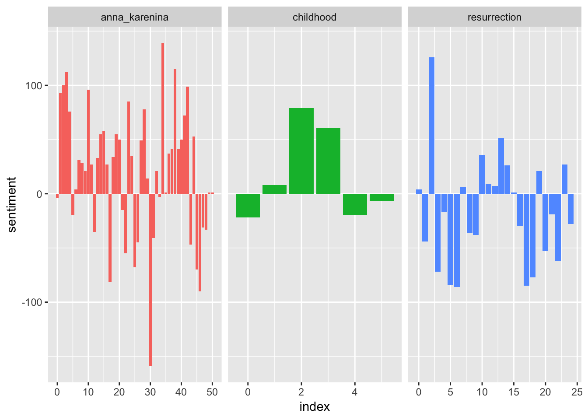

#Description of the Data
2. Description of the DATA you used (either given to you or where you found it, what unique characteristics of the
data, what quantitative and qualitative information is in the data set, etc.)
- Full text of three novels by Russian writer Leo Tolstoy:
  - *Childhood* (1852), translated into English by C.J. Hogarth
  - *Anna Karenina* (1877), translated into English by Constance Garnett
  - *Resurrection* (1899), translated into English by Mrs. Louise Maude
- Plaintext copies pulled from Project Gutenburg

---
#Description of the Data
Data cleaned and processed using `Python`
- Used the `NLTK` module
  - separated each text into a list of words
  - made all words lowercase
- Used the `csv` module
  - wrote a csv of each text, consisting of two columns, `title` and `words`

Then, data read into `R`. 

---
#Description of the Data
Used the following libraries in total:

```r
library(readr)
library(tidytext)
library(tidyverse)
library(viridis)
```

Then read in the csvs:

```r
anna_karenina<- read_csv("anna_karenina.csv", col_types = cols(title = col_factor(levels = NULL)))
childhood <- read_csv("childhood.csv", col_types = cols(title = col_factor(levels = NULL)))
resurrection<- read_csv("resurrection.csv", col_types = cols(title = col_factor(levels = NULL)))
```

---
#Description of the Data
Added a column with the row numbers:

```r
anna_karenina <- anna_karenina %>% 
  rownames_to_column()

childhood <- childhood %>% 
  rownames_to_column()

resurrection <- resurrection %>% 
  rownames_to_column()
```

Then, combined rows into one data frame:

```r
data <- bind_rows(childhood, anna_karenina, resurrection)
```

---
#Description of the Data

```r
glimpse(data)
```

```
## Observations: 564,231
## Variables: 3
## $ rowname <chr> "1", "2", "3", "4", "5", "6", "7", "8", "9", "10", "11...
## $ title   <chr> "childhood", "childhood", "childhood", "childhood", "c...
## $ words   <chr> "the", "tutor", "karl", "ivanitch", "on", "the", "of",...
```

```r
head(data)
```

```
## # A tibble: 6 x 3
##   rowname title     words   
##   <chr>   <chr>     <chr>   
## 1 1       childhood the     
## 2 2       childhood tutor   
## 3 3       childhood karl    
## 4 4       childhood ivanitch
## 5 5       childhood on      
## 6 6       childhood the
```

---
#Description of the Data

```r
data_final<- data %>% 
  group_by(title) %>% 
  inner_join(get_sentiments("bing"), by = c("words" = "word")) %>% 
  count(title, index = as.numeric(rowname)%/%max(as.numeric(rowname)/50), sentiment) %>%
  filter(as.numeric(index)!=50) %>% 
  spread(sentiment, n, fill = 0) %>%
  mutate(sentiment = positive/(positive+negative))

data_final$title<- fct_relevel(data_final$title, "childhood")
```

---
#Description of the Data

```r
head(data_final)
```

```
## # A tibble: 6 x 5
## # Groups:   title [1]
##   title         index negative positive sentiment
##   <fct>         <dbl>    <dbl>    <dbl>     <dbl>
## 1 anna_karenina     0      246      242     0.496
## 2 anna_karenina     1      166      259     0.609
## 3 anna_karenina     2      202      302     0.599
## 4 anna_karenina     3      176      288     0.621
## 5 anna_karenina     4      175      251     0.589
## 6 anna_karenina     5      238      218     0.478
```

---
#Graph

```r
labels <- c(childhood = "Childhood, 1852", anna_karenina = "Anna Karenina, 1877", resurrection = "Resurrection, 1899")

plot <- ggplot(data_final, aes(index, sentiment, color =  title)) +
  geom_point(size = .8, show.legend = FALSE) +
  geom_hline(aes(yintercept=.5))+
  geom_segment(aes(x=index, xend = index, y = sentiment, yend = .5)) +
  facet_wrap(~title, ncol = 3, labeller = labeller(title = labels)) +
  ggtitle("Positive and Negative Sentiment in Tolstoy Novels across Plot Trajectory", subtitle = "Sentiment > 0 indicates more positive than negative words \nSentiment < 0 indicates more negative than positive words      ") +
  labs(y = "Sentiment")+
  expand_limits(y=c(0,1)) +
  scale_color_viridis(discrete = TRUE, name = "Book", labels = labels) +
  theme_minimal() +
  theme(strip.text = element_text(face = "italic")) +
  theme(axis.title.x=element_blank()) +
  theme(axis.ticks.x=element_blank()) +
  theme(axis.text.x=element_blank()) +
  theme(legend.position = "bottom")
```

---
#Graph

```
## function (x, y, ...) 
## UseMethod("plot")
## <bytecode: 0x7f9bb8cf00e0>
## <environment: namespace:graphics>
```

---
3. Description of the AUDIENCE you are aiming for (including more detail than simply saying "a biochemist").

I am aiming for a general audience--but hopefully readers of Tolstoy. :)
4. Description of the TYPE of graph (e.g. Bar chart, Sankey Dendogram, etc).

---
5. Representation Description: What are you trying to show?
.pull-left[

```
## function (x, y, ...) 
## UseMethod("plot")
## <bytecode: 0x7f9bb8cf00e0>
## <environment: namespace:graphics>
```
]
.pull-right[
on your right
]
---
6. How to read it & what to look for: How should a newbie to this graph approach interpreting it? What are the major
highlights of the graph type?
.pull-left[

```
## function (x, y, ...) 
## UseMethod("plot")
## <bytecode: 0x7f9bb8cf00e0>
## <environment: namespace:graphics>
```

]
.pull-right[
on your right
]
---
7. Presentation: address how you are using annotation, color, and general composition (e.g. how are things arranged,
scale, etc.)
.pull-left[

```
## function (x, y, ...) 
## UseMethod("plot")
## <bytecode: 0x7f9bb8cf00e0>
## <environment: namespace:graphics>
```
]
.pull-right[
on your right
]
---

8. How I created it: Methods section (see point 1: all relevant code should be included); additionally, include a bit
about the process. Please include an early draft of your visualization (it might be a completely different), and why
you changed it/what you tweaked to get to your final visualization. 



---
8. How I created it: Methods section (see point 1: all relevant code should be included); additionally, include a bit
about the process. Please include an early draft of your visualization (it might be a completely different), and why
you changed it/what you tweaked to get to your final visualization. 

```r
bad_plot
```


